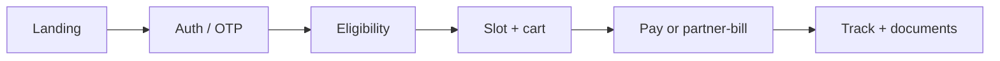

<div align="center">
  
  <br/>
  <a href="https://www.linkedin.com/in/ankita0930/">LinkedIn</a>
  ·
  <a href="https://x.com/ankita0930">X</a>
  ·
  <a href="https://codepen.io/Ankita09301">CodePen</a>
  ·
  <a href="mailto:ankitapal7777@gmail.com">Email</a>
</div>

<br/>

I don’t collect Hello World repos. I ship the screens people actually get stuck on: **pick a slot, pay, prove who you are, download a report when the network is bad.**

<table>
<tr>
<td width="58%" valign="top">

### Currently in production
At **Orange Health Labs** I own TypeScript / React / Next.js for:

- **Clinic & partner booking** — slots, cart, home vs clinic, payments, tracking  
- **Orange Auth** — phone/email OTP as a module other apps embed  
- **Group / corporate health** — SSO, family members, who-pays, eligibility  
- **Partner finance** — invoices, credit, RBAC, fewer spreadsheet nights  
- **Documents** — micro-frontend + Service Workers for offline capture  

</td>
<td width="42%" valign="top">

### How I work
```ts
type Ankita = {
  title: "Software Engineer 2"
  city: "Bengaluru"
  bias: "reusable over clever"
  review: "I will ask why this state lives here"
  never: "invented metrics in a resume"
}
```

**Also true:** I review code, mentor, and have managed interns. I will fight a four-hour CSV if a tool can eat it.

</td>
</tr>
</table>

### A flow I keep rebuilding (on purpose)



If your product has this skeleton, I have already cut myself on the edge cases: walk-ins, unpaid orders, expired camps, the photo that must be geo-tagged.

<details>
<summary><b>Stack I actually reach for</b></summary>
<br/>

| Layer | Tools |
| --- | --- |
| Language | TypeScript, JavaScript |
| UI | React, Next.js, HTML, CSS, Sass, MUI |
| State | Redux / Persist, Context |
| Product guts | REST, OTP, SSO, RBAC, webhooks, Service Workers |
| Proof | Mixpanel, CleverTap, Grafana, Postman, Figma |

</details>

<details>
<summary><b>Before this lab</b></summary>
<br/>

**Netix.ai** — React + REST across asset / user / device admin; Grafana as a real dashboard, not a screenshot.  
**AppyHigh · Phot.ai** — Figma → production React. Product Hunt *Product of the Day/Week*. Performance score **95** from lazy load + render work, not from a blog title.

</details>

<p align="center">
  
  
</p>

<p align="center"><i>Public graph ≠ private product. Most of the interesting code is behind a VPN. Pins will catch up.</i></p>
