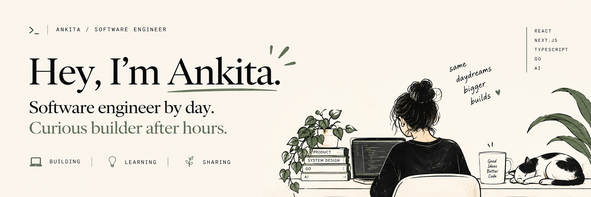

### ~/about

Software Engineer II at Orange Health Labs. I work on production web apps for corporate and doctor-facing use: partner-specific experiences, authentication, and order management, in React, Next.js, and TypeScript.

### ~/selected-work

**[ApplyKit](https://github.com/Ankita297/Applykit)** — local-first job-search workspace. One master resume, a pasted job description, and a fit check (matches, gaps, what to leave alone), plus an application tracker and a Chrome extension that fills empty fields and never submits. Optional cover letters and cold emails use only facts already on the resume. It does not rewrite the resume. Data stays in SQLite on your machine.

**[Way2Intern](https://www.way2intern.com/)** — software-engineering internship mentorship for students: practical learning and preparation. Way2Ship is the hands-on, project-based program.

**[StreakAI](https://github.com/Ankita297/StreakAI)** — a small iPhone app for one commitment at a time. Chapters instead of an endless streak, honest check-ins, reminders, a Home Screen widget, and a named companion. Chat is on-device until you point it at an API. Habits stay on the phone.

### ~/toolbox

**Working with** — React · Next.js · JavaScript · TypeScript · HTML · CSS

**Learning** — Go · backend systems · system design · AI engineering

### ~/now

Go and backend engineering, system design, and AI engineering — in small projects I can run, written down as I go.

### ~/connect

[LinkedIn](https://www.linkedin.com/in/ankita0930/) · [X](https://x.com/ankita0930) · [GitHub](https://github.com/Ankita297)
